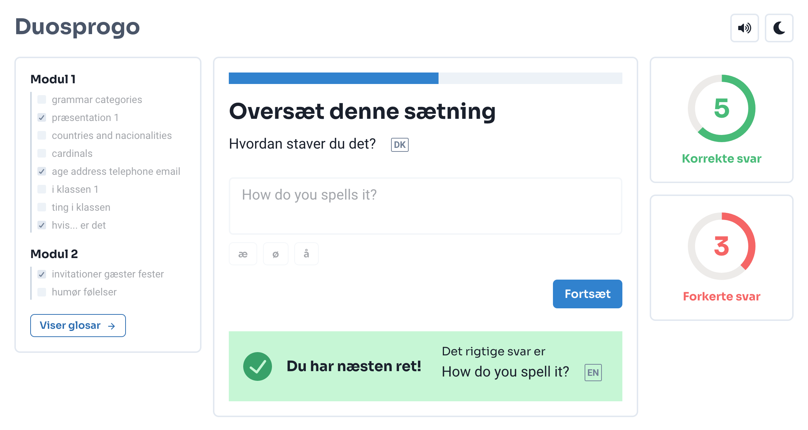

<br>
<p align="center">

</p>
<br>

# Duosprogo
[](https://github.com/JnxF/duosprogo/actions/workflows/codeql-analysis.yml)

[](https://GitHub.com/JnxF/duosprogo/stargazers/)
[](https://GitHub.com/JnxF/duosprogo/network/)
[](https://github.com/JnxF/duosprogo)
[](https://GitHub.com/JnxF/duosprogo/graphs/contributors/)
[](https://github.com/JnxF/duosprogo/blob/master/LICENSE)

Duosprogo is _the_ React frontend to learn Danish.

## Installation

Nagivate to the root folder and install the dependencies with [npm](https://www.npmjs.com/).

```bash
npm install
```

## Usage

The application will start at [http://localhost:3000/danish](http://localhost:3000/danish).

```bash
npm start
```

## License
[MIT](https://choosealicense.com/licenses/mit/)